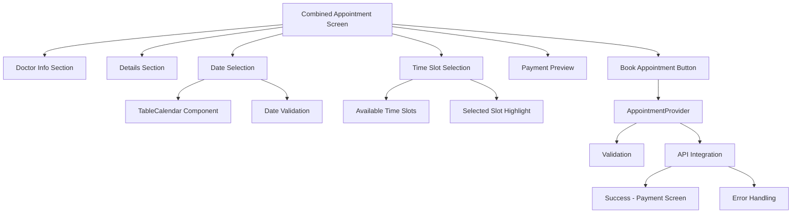

# Appointment Booking Integration Plan

## Overview
Integrate the UI components from AppointmentScreen with the functional appointment booking capabilities from SelectDateAndTime to create a unified, polished booking experience.

## Components Integration

### 1. UI Components
- Doctor information section
- Appointment details section
- Payment preview section
- Enhanced date/time selection
  - Replace horizontal date picker with TableCalendar
  - Maintain styled time slot selection
- Loading and error states
- Book appointment button

### 2. Functional Components
- AppointmentProvider integration
- Date and time validation
- Appointment creation API integration
- Success/error handling
- Navigation to payment screen

## Data Flow

## Implementation Steps

1. UI Migration
   - Merge the visual components from AppointmentScreen
   - Replace date selector with TableCalendar
   - Maintain existing styling and theme

2. State Management
   - Integrate AppointmentProvider
   - Add loading states
   - Implement error handling

3. Validation & Business Logic
   - Add date range validation
   - Implement working hours verification
   - Add appointment conflict checking

4. API Integration
   - Connect appointment creation
   - Handle API responses
   - Manage loading states

5. Navigation Flow
   - Success → Payment screen
   - Error → Show error message
   - Back → Previous screen

## Technical Considerations

### Dependencies
- table_calendar: For enhanced date selection
- provider: For state management
- intl: For date formatting

### State Management
- Track selected date and time
- Manage loading states
- Handle error conditions
- Store appointment details

### Validation Rules
- Date must be within allowed range
- Time slot must be available
- Required fields must be filled
- No conflicting appointments

### Error Handling
- Network errors
- Validation errors
- Server errors
- Conflict errors

## Future Enhancements
- Real-time slot availability
- Appointment reminders
- Cancellation flow
- Rescheduling capabilities