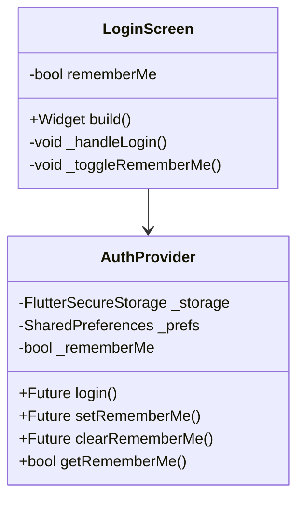
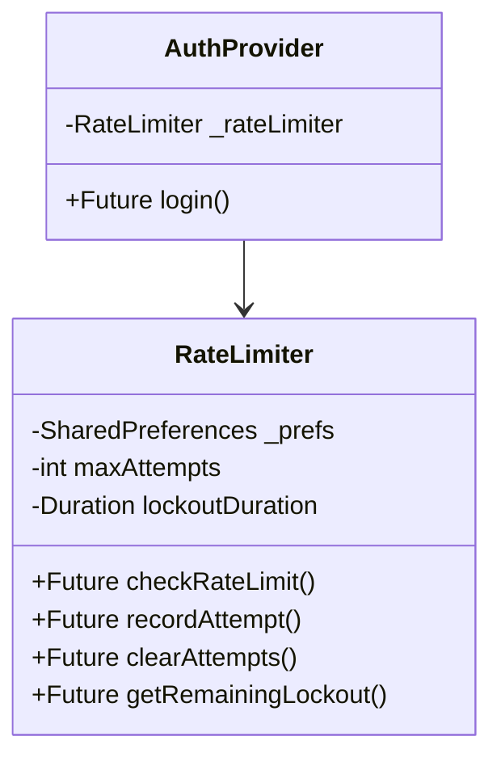

# Authentication Features Implementation Plan

## Overview
This document outlines the plan for implementing two key authentication features:
1. Remember Me functionality
2. Rate limiting for login attempts

## 1. Remember Me Functionality

### Class Structure


### Implementation Steps
1. Add Remember Me checkbox in LoginScreen:
   - Add checkbox widget with state management
   - Persist checkbox state using SharedPreferences
   - Update UI to reflect saved state

2. Modify AuthProvider:
   - Add SharedPreferences dependency for remember me state
   - Implement secure credential storage using Flutter Secure Storage
   - Add methods for managing remember me state
   - Handle auto-fill when returning to login screen
   - Implement secure credential clearing on logout

3. Security Considerations:
   - Encrypt saved credentials
   - Clear saved data after prolonged inactivity
   - Implement secure storage best practices

## 2. Rate Limiting

### Class Structure


### Implementation Steps
1. Create RateLimiter Class:
   - Track login attempts with timestamps
   - Implement lockout mechanism
   - Add cooldown period functionality
   - Handle attempt clearing and reset

2. Integrate with AuthProvider:
   - Add rate limiter instance
   - Check limits before login attempts
   - Record success/failure attempts
   - Handle lockout states

3. Update UI Components:
   - Display remaining attempts
   - Show lockout countdown
   - Present clear error messages
   - Add user feedback for rate limiting

## Technical Details

### Data Storage Schema
```dart
// Remember Me Storage
{
  "remember_me_enabled": bool,
  "saved_email": String?, // encrypted
  "saved_password": String?, // encrypted
}

// Rate Limiting Storage
{
  "login_attempts": [{
    "timestamp": DateTime,
    "ip_address": String,
    "success": bool
  }],
  "lockout_until": DateTime?
}
```

### Configuration Constants
```dart
const int MAX_LOGIN_ATTEMPTS = 5;
const Duration LOCKOUT_DURATION = Duration(minutes: 15);
const Duration ATTEMPT_WINDOW = Duration(hours: 1);
```

### Security Measures
1. Credential Security:
   - Encrypt all saved credentials
   - Use Flutter Secure Storage for sensitive data
   - Implement automatic cleanup for stale data

2. Rate Limiting Security:
   - Device fingerprinting to prevent bypass attempts
   - Exponential backoff for repeated failures
   - Persistent attempt tracking

## Implementation Timeline
1. Phase 1 - Remember Me (2-3 days):
   - Implement basic functionality
   - Add secure storage
   - Test persistence and security

2. Phase 2 - Rate Limiting (2-3 days):
   - Create RateLimiter class
   - Integrate with auth flow
   - Add UI feedback

3. Phase 3 - Testing & Refinement (1-2 days):
   - Security testing
   - Edge case handling
   - Performance optimization