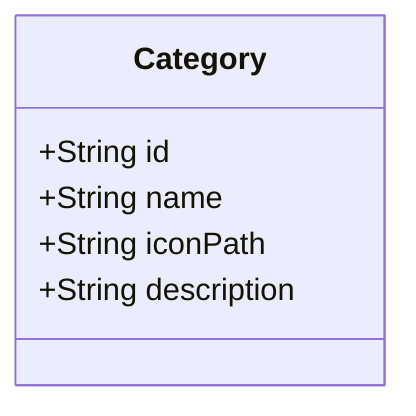
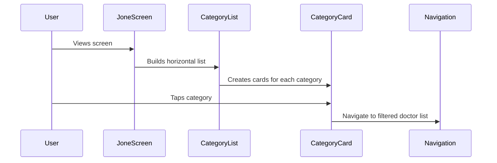

# Category Implementation Plan

## Data Structure

## UI Flow

## Implementation Steps

1. Create CategoryCard Widget:
   - Custom card design with icon and specialty name
   - Consistent styling with app theme
   - Tap handling for navigation

2. Create Horizontal CategoryList Widget:
   - ListView.builder with horizontal scroll
   - Shows category cards with proper spacing
   - Handles overflow with proper scrolling behavior

3. Add Predefined Medical Categories:
   - Common specialties like Cardiology, Pediatrics, etc.
   - Icon assets for each specialty
   - Localized category names

4. Integration in JoneScreen:
   - Add after existing categories header
   - Proper spacing and padding
   - Consider loading states

5. Navigation Handling:
   - Update search/filter logic to include selected category
   - Pass category data to doctor search screen

## Technical Details

- The category selection will be implemented as a horizontally scrollable list
- Each category will be represented by a card with an icon and name
- Categories will be based on medical specialties from the existing doctor model
- UI will be consistent with the app's existing design language
- Navigation will filter doctors based on selected specialty