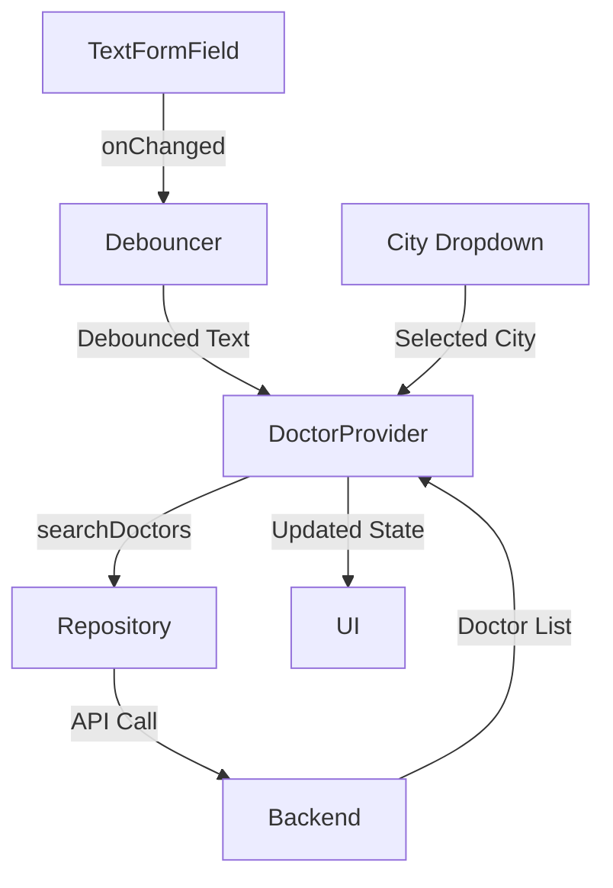

# Doctor Search Feature Implementation Plan

## Overview
This document outlines the implementation plan for adding doctor search functionality to the Tabibi application, integrating with the existing `/api/clinic/doctors` endpoint.

## 1. State Management

Create a new `DoctorProvider` to manage:
- List of all doctors
- Filtered doctors based on search
- Loading states
- Error states

## 2. UI Changes (all_doctors.dart)

- Convert to StatefulWidget
- Connect existing search TextFormField to filter functionality
- Add city filter dropdown
- Implement loading indicators
- Add error state handling
- Update DoctorCard to display full doctor information:
  - Name
  - Specialty
  - City
  - Rating
  - Review count
  - Description
  - Image

## 3. API Integration

### Data Flow


### Implementation Details
- Initial load: `getDoctors()`
- Search: `searchDoctors(query, city)`
- Add debouncing for search input
- Handle API responses and errors

## 4. Error Handling

- API failure error messages
- Empty state handling
- Loading state indicators

## 5. Testing

### Unit Tests
- DoctorProvider tests
  - Initial state
  - Search functionality
  - Error handling

### Widget Tests
- Search functionality
- City filter
- Loading states
- Error states

### Integration Tests
- API integration
- End-to-end search flow

## API Endpoint Reference

### Get All Doctors
```
GET /api/clinic/doctors
```

### Search Doctors
```
GET /api/clinic/doctors?Specialization=1&City=Adrar
```

Required Headers:
```http
Accept: application/json
Authorization: Bearer {token} (if protected)