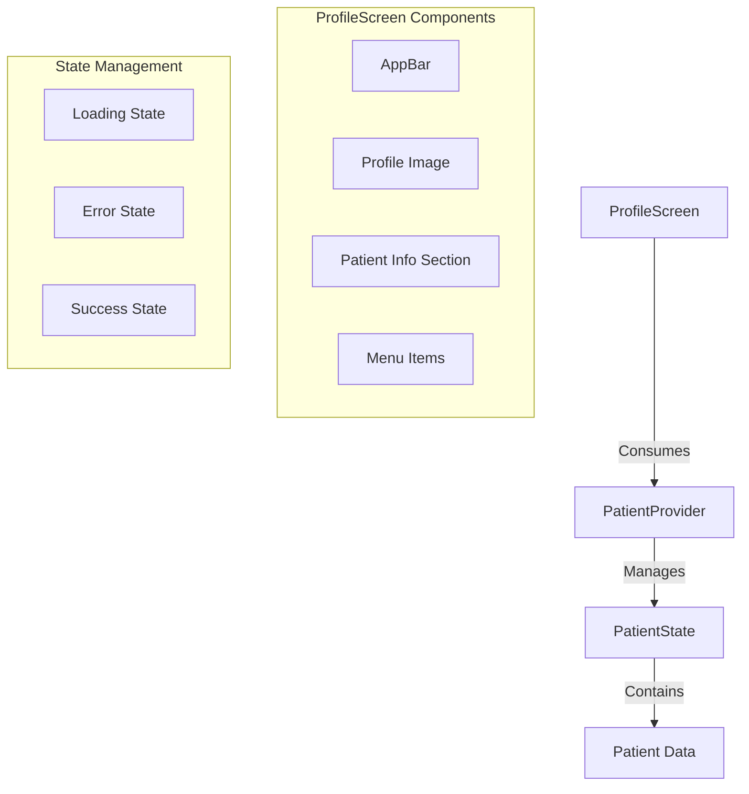

# Patient Profile Integration Plan

## Current State Analysis

- ProfileScreen is currently a StatelessWidget with hardcoded data
- PatientProvider available with patient state management 
- Patient model contains: fullName, gender, birthDate, phoneNumber, email

## Architecture Diagram

## Implementation Plan

### 1. UI Layer Changes
- Convert ProfileScreen to StatefulWidget
- Add Consumer widget to access PatientProvider
- Create loading indicator widget
- Create error message display
- Update profile section to display dynamic data
- Format date and other fields appropriately

### 2. State Management
- Access PatientProvider through Provider.of or Consumer
- Handle all three states: loading, error, and success
- Display appropriate UI based on state

### 3. Data Display
- Show patient's full name instead of hardcoded "John Doe William"
- Add additional patient info section with:
  - Email
  - Phone number  
  - Gender
  - Birth date (formatted)
- Keep the menu items section as is for now

### 4. Error Handling
- Show error message if patient data fails to load
- Add retry mechanism if needed

## Next Steps

1. Implement UI changes in ProfileScreen
2. Add state management integration
3. Test with real patient data
4. Add error handling and loading states
5. Perform final testing